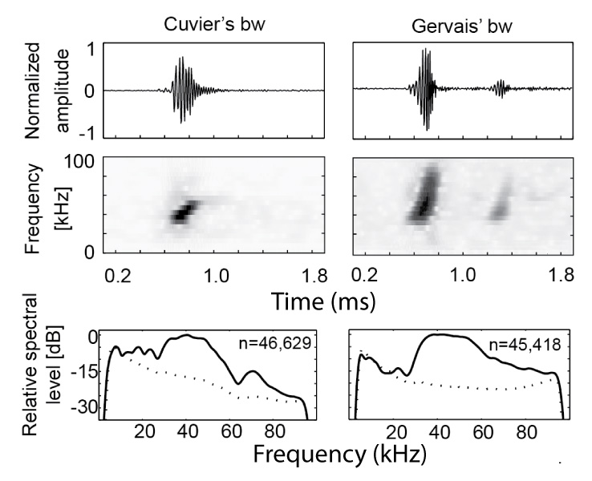

# whale_classification
 
__ABOUT : __ This project is based on underwater sound data collected in the Gulf of Mexico during and since the time of the Deepwater Horizon Oil Spill in 2010.

__TASK : __ The task is to assess what species of whales were present at the three recording sites, one near the leaking well, and other two just outside the bounds of the spill.

The classification was performed using the echo-location clicks emitted by beaked whales. These are very short pulses (less than a ms) that whales and dolphins use to sense their surroundings, including the detection of prey. Different species of beaked whales emit clicks with different waveforms and spectral distributions. The time intervals between clicks also provides information about the species. Example clicks from __CUVIER__ and __GERVAIS__ beaked whales are shown below:

